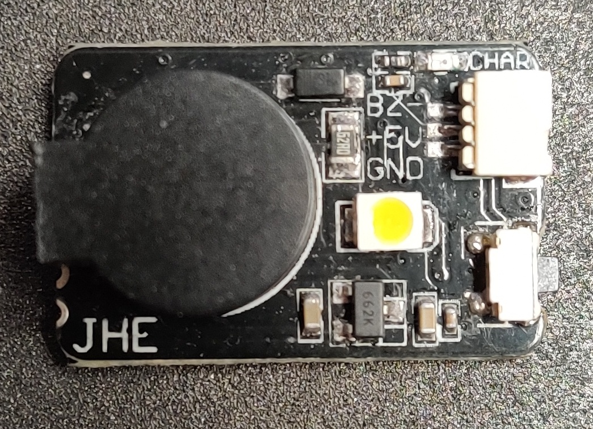
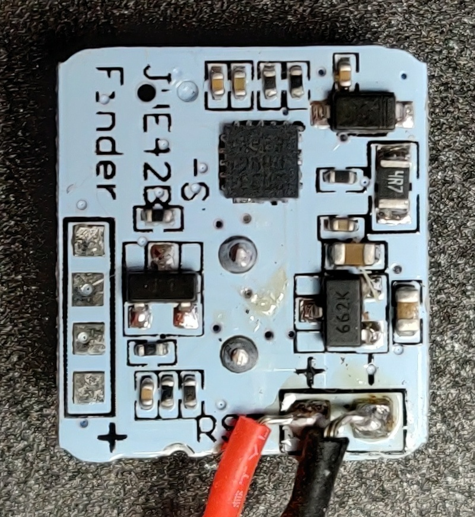

# JHE42B and JHE42B_S open firmware


Goal is to replace the default firmware in order to add common features found on other autonomous buzzer.

Espacially disarming buzzer without using onboard button.

[[_TOC_]]

# Reverse process
(checked if working)

- [x] power supply detection
- [x] blink onboard LED
- [x] blink onboard LED
- [x] bip on bipper
- [x] button press


# Features

(checked if implemented)

- [ ] Activates 30s after power loss (5V)
- [ ] BEEPS every 30s (default)
- [ ] Disarm when button is pressed 3s
- [ ] Disarm if power supply is removed after 10-12s (usefull when button is not accesible)
- [ ] Power saving by changing BEEPS frequency 10s / 30s / 60s (default 30s)
- [ ] LIGHT flashs for every beeps (built-in)


# How to flash
## Requirements


[vscode](https://code.visualstudio.com/) or any IDE supporting PlatformIO

You need a ST-link v2, so you can write firmware onto the STM8 flash memory.


## PlatformIO setup

Follow instruction of [platfomio-ststl8](https://github.com/platformio/platform-ststm8#readme)

**STM8S003F3** definitions should be available in **platfomio-ststl8** since [#PR28](https://github.com/platformio/platform-ststm8/pull/28).

Otherwise add board definition [stm8s003f3.json](https://github.com/nerocide/platform-ststm8/blob/develop/boards/stm8s003f3.json) in :
> C:\Users\<user>\.platformio\platforms\ststm8\boards


## Unlock chip
Every chip has to be unlocked once. (from experience)
```
cd .platformio\packages\tool-stm8tools
stm8flash -c stlinkv2 -u -p stm8s003?3
```

## STMLinker connection

You should connect your wires as follow to the linker.


If you don't want to solder on board, you can use a contraption like so...


# Boards

## Identified models

Model|Controller|Chip Mark
-----|----------|---------
JHE42B|STM8S003F3 TSSOP20|STM8S003F3P6
JHE42B_S|STM8S003F3 UFQFPN20|S033PHVG822Y


## Commercial shot
<!--  -->


## JHE42B
<!--  -->
<!--  -->

 
<!--  -->

## JHE42B_S
<!--  -->
<!--  -->

 


# Resources
[ST STM8S003F3 DataSheet](/doc/STM8S0003F3_datasheet_dm00024550.pdf)