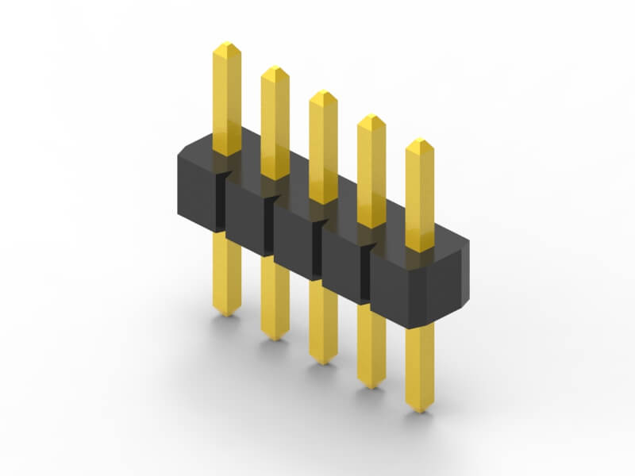
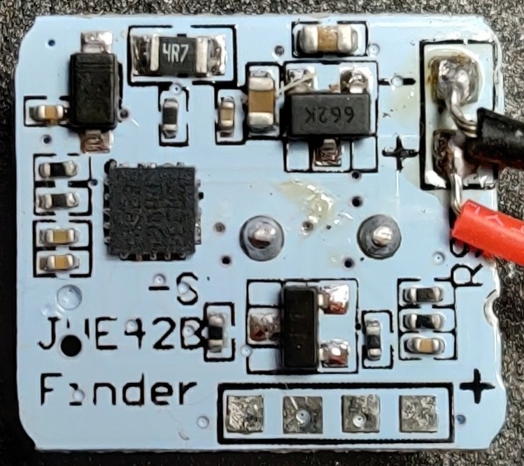
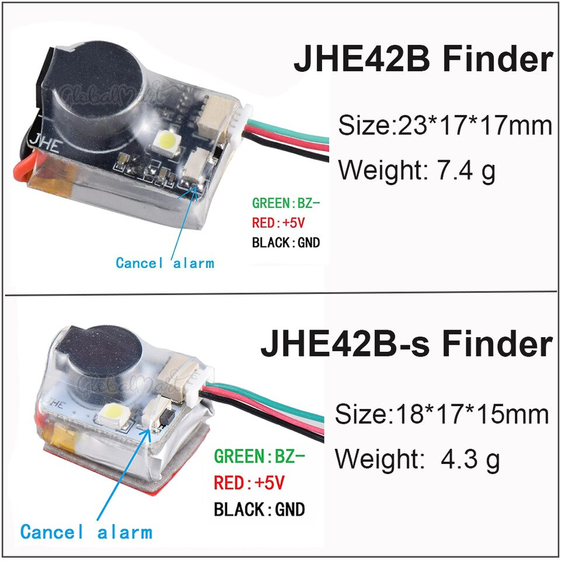

# JHE42B and JHE42B_S open firmware

The idea is to replace the default firmware in order to add common features found on other autonomous buzzer.

Espacially disarming buzzer without using onboard button.

# Features

(checked if implemented)

- [x] BEEPS every 30s after power loss (default)
- [x] Turn ON/OFF onboard red LED depending on arming status (ON when armed)
- [x] Disarm system when button is pressed
- [x] Disarm if power supply is removed after 10-12s if armed (usefull when button is not accesible)
- [ ] Power saving by changing BEEPS frequency 10s / 30s / 60s (default 30s)
- [x] BEEPS on signal pin request
- [x] LIGHT flashs for every beeps (built-in)


## Board testing matrix

|Model|BEEPS on power loss|Arming Red LED|Button disarm| Power source trick disarm| Power saving | LED Flash | BEEPS on signal
|---|---|---|---|---|---|---|---|
|JHE42B|:heavy_check_mark:|:heavy_check_mark:|:heavy_check_mark:|:heavy_check_mark:||:x:|:heavy_check_mark:|
|JHE42B_S|:grey_question:|:grey_question:|:grey_question:|:grey_question:||:grey_question:|:grey_question:|

:x: ko / :heavy_check_mark: ok / :grey_question: todo or more testing required

# User manual

Apply power to buzzer to ARM it (notice 3 notes arming sequence and red LED turing on)

Buzzer will ring every 30s after power is loss

To disarm, either pressing the onboard button for more than `2s`, or apply power for `10-12s` then remove.

Notice 3 notes disarming tune, and red LED turn off.


# How to Build/Flash
## Requirements
- [vscode](https://code.visualstudio.com/) or any IDE supporting [PlatformIO](https://platformio.org/)
- [ST-link v2](https://a.aliexpress.com/_ExNkgOT) (so you can write firmware onto the STM8 flash memory) [how to connect it?](#STMLinker-connection)

## PlatformIO setup

- Follow instruction of [platfomio-ststl8](https://github.com/platformio/platform-ststm8#readme)
- clone the repo and open the project in vscode/pio
- [PlatformIO](https://platformio.org/) should download and install all the toolchain/dependencies
- build
- upload/flash

Otherwise add board definition [stm8s003f3.json](https://github.com/nerocide/platform-ststm8/blob/develop/boards/stm8s003f3.json) in :
> C:\Users\<user>\.platformio\platforms\ststm8\boards


## Unlock chip
Every chip has to be unlocked once. (from experience)
```
cd .platformio\packages\tool-stm8tools
stm8flash -c stlinkv2 -u -p stm8s003?3
```

## STMLinker connection

You should connect your wires as follow to the linker.


If you don't want to solder on board, you can use a contraption like so...


+



# Compatible Boards
Model|Controller|Chip Mark|Pictures
-----|----------|---------|-----
JHE42B|STM8S003F3 TSSOP20|STM8S003F3P6| 
JHE42B_S|STM8S003F3 UFQFPN20|S033PHVG822Y| 


## Commercial shot
<!--  -->



<!-- ## JHE42B -->
<!--  -->
<!--  -->

<!--   -->
<!--  -->

<!-- ## JHE42B_S -->
<!--  -->
<!--  -->

<!--   -->

# Reverse process
(checked if working)

- [x] power supply detection
- [x] blink onboard red LED
- [x] blink onboard white LED
- [x] bip on buzzer
- [x] button press
# Resources
[ST STM8S003F3 DataSheet](ressources/doc/STM8S0003F3_datasheet_dm00024550.pdf)
[ST STM8 debug]([ressources/doc/STM8S0003F3_datasheet_dm00024550.pdf](https://circuitdigest.com/microcontroller-projects/serial-monitor-on-stm8s-using-cosmic-and-stvd))